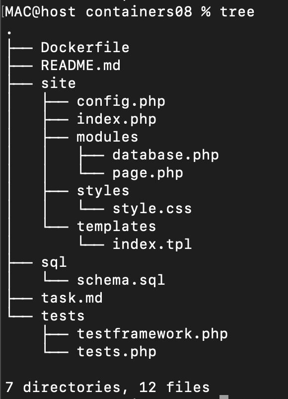
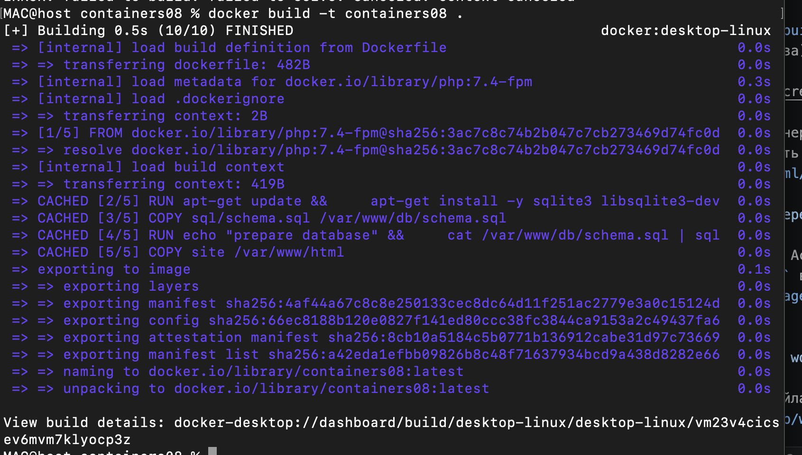
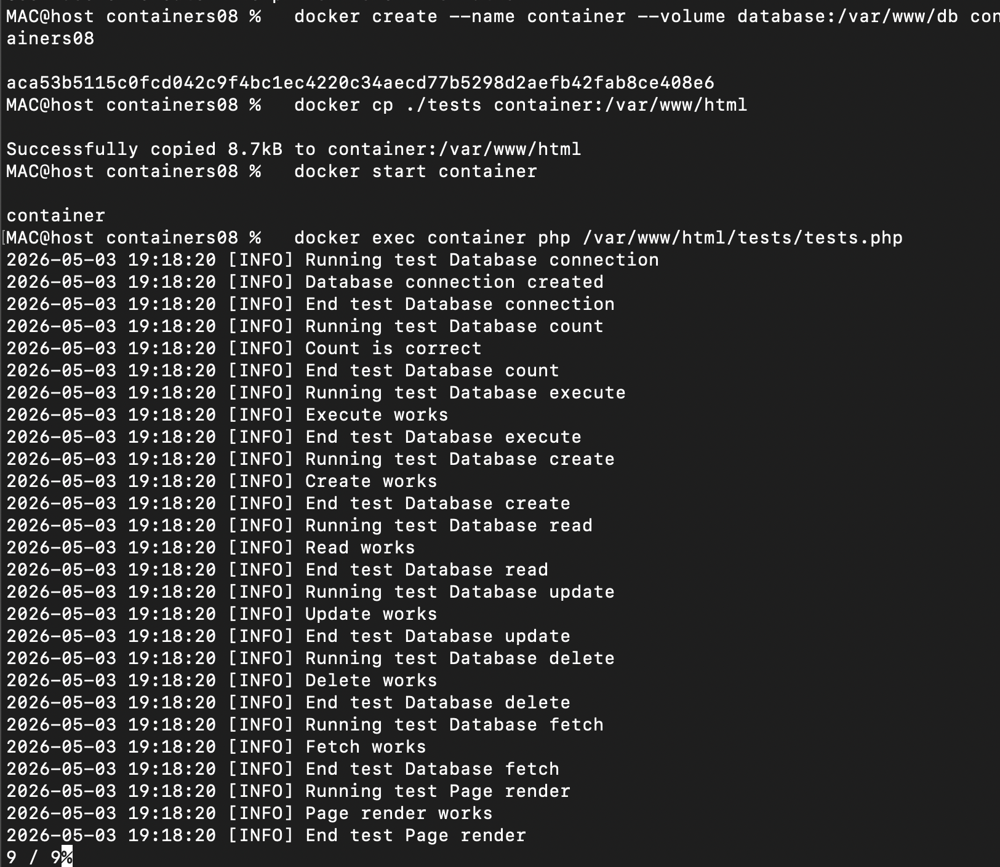

# Лабораторная работа: Непрерывная интеграция с Github Actions

IA2404 Voronetchii Stanislav

## Цель работы
Настроить непрерывную интеграцию для веб-приложения на PHP с использованием Docker и GitHub Actions

## Задание
Создать Web приложение, написать тесты для него и настроить непрерывную интеграцию с помощью Github Actions на базе контейнеров

## Выполнение работы
1. Создана структура проекта `site/` с PHP-приложением, шаблоном, стилями и конфигурацией

2. Реализован класс `Database` для работы с SQLite: подключение, выполнение запросов, CRUD-методы и подсчет записей
3. Реализован класс `Page` для подстановки данных в шаблон страницы
4. Добавлен SQL-файл `sql/schema.sql` с таблицей `page` и начальными данными
5. Созданы тесты для всех методов `Database` и `Page`
6. Настроен `Dockerfile` для подготовки базы данных и сборки приложения
Билд образа:

Запуск тестов в контейнере:

7. Добавлен workflow GitHub Actions для сборки образа и запуска тестов в контейнере
```yml
name: CI

on:
  push:
    branches:
      - main

jobs:
  build:
    runs-on: ubuntu-latest
    steps:
      - name: Checkout
        uses: actions/checkout@v4
      - name: Build the Docker image
        run: docker build -t containers08 .
      - name: Create `container`
        run: docker create --name container --volume database:/var/www/db containers08
      - name: Copy tests to the container
        run: docker cp ./tests container:/var/www/html
      - name: Up the container
        run: docker start container
      - name: Run tests
        run: docker exec container php /var/www/html/tests/tests.php
      - name: Stop the container
        run: docker stop container
      - name: Remove the container
        run: docker rm container

```


## Ответы на вопросы
1. Что такое непрерывная интеграция?

   Это подход, при котором изменения в коде регулярно собираются и проверяются автоматически: запускаются сборка, тесты и другие проверки качества

2. Для чего нужны юнит-тесты? Как часто их нужно запускать?

   Юнит-тесты проверяют отдельные части программы изолированно и позволяют быстро находить ошибки. Запускать их нужно после каждого изменения кода и в CI при каждом push/merge request

3. Что нужно изменить в файле `.github/workflows/main.yml` для того, чтобы тесты запускались при каждом создании запроса на слияние (Pull Request)?

   Нужно добавить триггер `pull_request` в секцию `on`, например:

   ```yaml
   on:
     push:
       branches:
         - main
     pull_request:
       branches:
         - main
   ```

4. Что нужно добавить в файл `.github/workflows/main.yml` для того, чтобы удалять созданные образы после выполнения тестов?

   Нужно добавить шаг очистки образа после выполнения тестов, например:

   ```yaml
   - name: Remove the image
     if: always()
     run: docker rmi containers08
   ```

## Выводы
В работе создано PHP-приложение с SQLite, написаны тесты для основных методов классов и настроен CI-процесс в GitHub Actions с запуском внутри Docker-контейнера.
